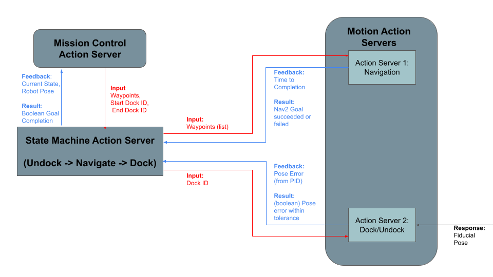

# robot_motion_server
Action Servers and Clients to give Robot Navigation Commands

# Nodes Included

Each node represents one form of Navigation

1. Navigation Action Server
2. Dock/Undock Action Server

# Action Messages
The message formats for both action servers are present in the robot_action_interface package
along with all other interface definitions

# Action Server Logic

## High Level Logic

The action servers are part of the state machine on the robot which will call on each
action server independently

## Low Level Logic

Each action server communicates vital feedback or results which need to be propogated to
the top level nodes. This specific communication is shown below

